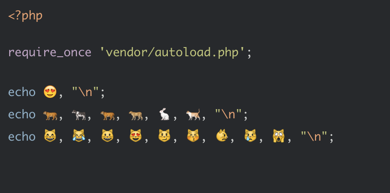

# Emoji Literals



## Requirements

PHP 5.3+

## Installation

Through [composer](http://getcomposer.org):

```bash
$ composer require whatthejeff/emoji-literals:~1.0
```

## Inspiration

This pointless library was inspired by [another pointless library](https://github.com/TazeTSchnitzel/escapes).

## License

[MIT](LICENSE)
